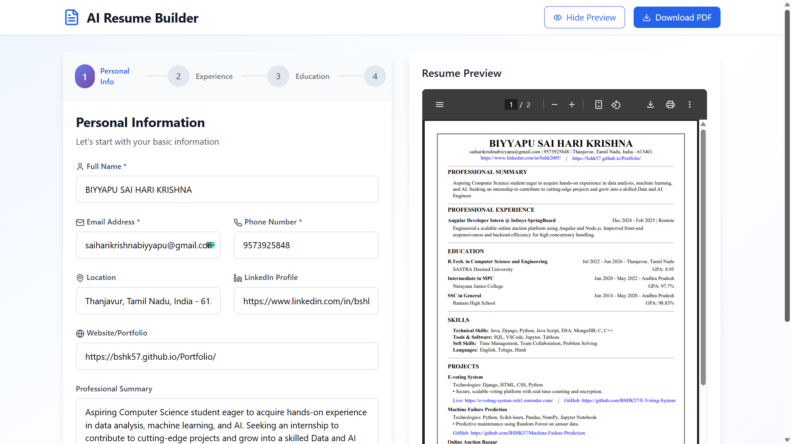

# Resume-Builder

A modern, interactive, resume builder built with React and Tailwind CSS.

## Features
- Step-by-step resume creation (Personal Info, Experience, Education, Skills, Projects, Achievements)
- Live resume preview as you fill out your information
- Download your resume as a PDF
- Beautiful, responsive UI with Tailwind CSS
- Context-aware forms for each resume section
- Add, edit, and remove multiple entries for each section
- Categorized skills and achievements
- Save and reset your progress (in-memory)

## Demo


## Getting Started

### Prerequisites
- Node.js (v14 or higher recommended)
- npm

### Installation
```bash
npm install
```

### Running the App
```bash
npm start
```
The app will run locally at [http://localhost:3000](http://localhost:3000).

### Building for Production
```bash
npm run build
```

## Project Structure
```
Resume_Builder/
├── public/
│   └── index.html
├── src/
│   ├── App.js
│   ├── index.js
│   ├── index.css
│   ├── components/
│   │   ├── ResumeBuilder.js
│   │   ├── ResumePreview.js
│   │   ├── PDFGenerator.js
│   │   ├── StepNavigation.js
│   │   └── steps/
│   │       ├── PersonalInfoStep.js
│   │       ├── ExperienceStep.js
│   │       ├── EducationStep.js
│   │       ├── SkillsStep.js
│   │       ├── ProjectsStep.js
│   │       └── AchievementsStep.js
│   └── contexts/
│       └── ResumeContext.js
├── tailwind.config.js
├── postcss.config.js
├── package.json
└── README.md
```

## Dependencies
- React
- Tailwind CSS
- jsPDF & html2canvas (for PDF export)
- lucide-react (icons)

## Usage
1. Fill out each section of the form.
2. Preview your resume live on the right (toggle preview).
3. Download your resume as a PDF when ready.

## Customization
- You can modify the UI and add more sections or fields as needed.
- Tailwind CSS makes it easy to adjust styles.

## License
This project is licensed under the MIT License.

---

*Built with ❤️ using React and Tailwind CSS.*
